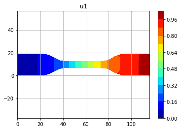
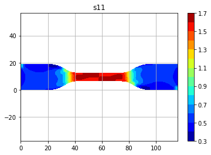
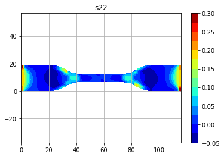
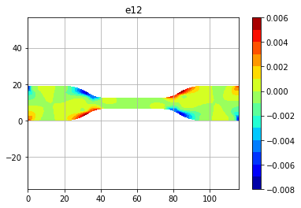

Here is a demo code to display all outputs of a 2D Finite Element Analysis on a dogbone.

```
from mechy import FEM
FILE_PATH='test.txt'
plot_type='all'

s=FEM()
s.fem2d(FILE_PATH,plot_type)
```
##Displacement_X

##Stress_11

##stress_22

##strain_12

